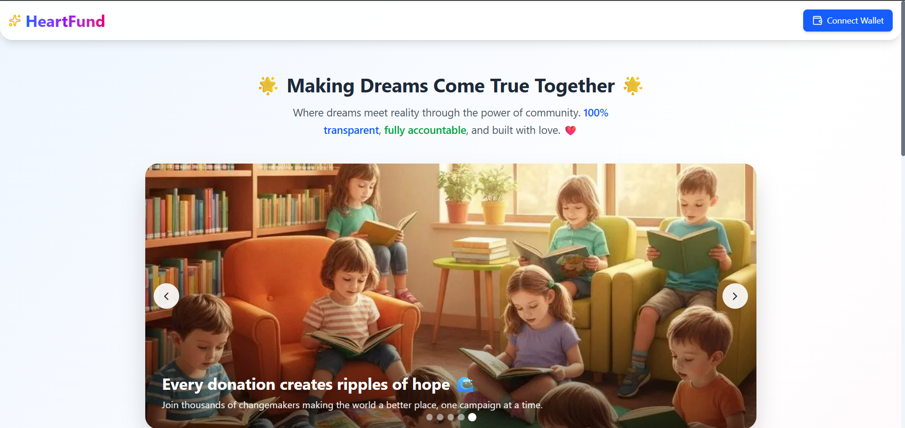

# HeartFund - Decentralized Crowdfunding Platform


[](https://opensource.org/licenses/MIT)
[](https://reactjs.org/)
[](https://nextjs.org/)

HeartFund is a blockchain-based crowdfunding platform that enables transparent, secure, and direct funding for charitable and social impact projects. Built with Next.js, Ethers.js, and Firebase, HeartFund connects donors directly with campaign creators, eliminating intermediaries and ensuring that funds reach their intended recipients.

<p align="center">
  
</p>

## Features

- **Blockchain-Based Donations**: Make secure donations using cryptocurrency with full transparency
- **Transparent Fund Tracking**: All transactions are recorded on the blockchain for public verification
- **Campaign Creation**: Anyone can create a campaign to raise funds for charitable causes
- **Donor Recognition**: View all donors who have contributed to campaigns
- **Campaign Status Tracking**: Track campaign progress and fund distribution in real-time

## Tech Stack

- **Frontend**: [Next.js](https://nextjs.org/), [React](https://reactjs.org/), [TailwindCSS](https://tailwindcss.com/)
- **Blockchain**: [Ethers.js](https://docs.ethers.io/), [Web3.js](https://web3js.readthedocs.io/), [MetaMask](https://metamask.io/)
- **Backend & Database**: [Firebase](https://firebase.google.com/)
- **Smart Contract**: [Solidity](https://soliditylang.org/) (Ethereum)

## Getting Started

### Prerequisites

- [Node.js](https://nodejs.org/) 18.x or higher
- [MetaMask](https://metamask.io/) wallet extension
- [Git](https://git-scm.com/)
- A Firebase project (for database functionality)

### Installation

1. Clone the repository:

```bash
git clone https://github.com/devraj-1234/crowdfunding-dapp.git
cd crowdfunding-dapp
```

2. Install dependencies:

```bash
npm install
```

3. Create a `.env.local` file in the root directory with your Firebase and contract configurations:

```
NEXT_PUBLIC_FIREBASE_API_KEY=your_firebase_api_key
NEXT_PUBLIC_FIREBASE_AUTH_DOMAIN=your_firebase_auth_domain
NEXT_PUBLIC_FIREBASE_PROJECT_ID=your_firebase_project_id
NEXT_PUBLIC_FIREBASE_STORAGE_BUCKET=your_firebase_storage_bucket
NEXT_PUBLIC_FIREBASE_MESSAGING_SENDER_ID=your_firebase_messaging_sender_id
NEXT_PUBLIC_FIREBASE_APP_ID=your_firebase_app_id

NEXT_PUBLIC_CONTRACT_ADDRESS=your_deployed_contract_address
```

4. Run the development server:

```bash
npm run dev
```

5. Open [http://localhost:3000](http://localhost:3000) to view the application

## Smart Contract

The project uses a custom Crowdfunding smart contract that handles:

- Campaign creation with fundraising goals and deadlines
- Donation processing with donor tracking
- Fund withdrawal by campaign owners upon successful completion
- Campaign cancellation with automatic refunds when goals aren't met

## Key Components

- **WalletConnect**: Handles MetaMask integration and wallet management
- **CampaignList**: Displays available funding opportunities
- **CampaignDetails**: Shows comprehensive information about each campaign
- **CreateCampaignForm**: Interface for launching new fundraising initiatives

## Contributing

We welcome contributions from the community! Here's how you can help:

1. Fork the repository
2. Create your feature branch (`git checkout -b feature/amazing-feature`)
3. Commit your changes (`git commit -m 'Add some amazing feature'`)
4. Push to the branch (`git push origin feature/amazing-feature`)
5. Open a Pull Request

## License

This project is licensed under the MIT License - see the [LICENSE](LICENSE) file for details.

## Acknowledgments

- [Ethereum Foundation](https://ethereum.org/)
- [The Next.js Team](https://nextjs.org/)
- All our contributors and supporters
